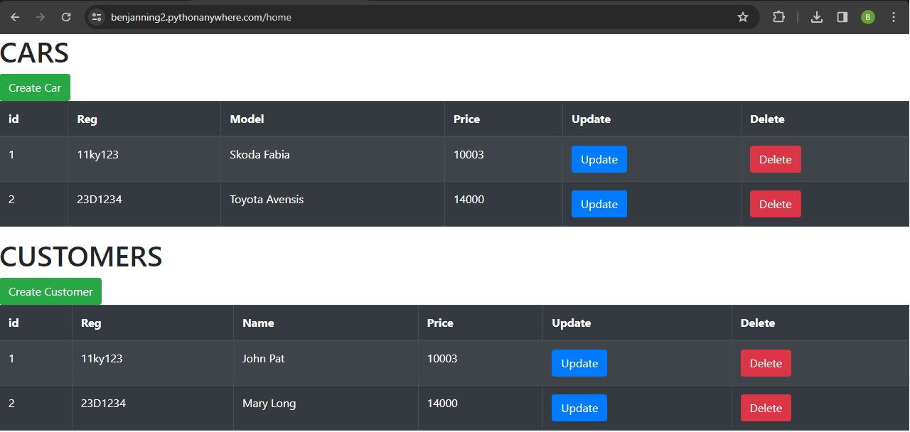
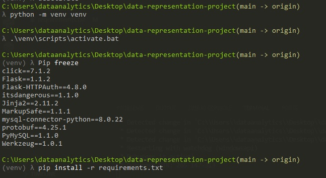

# Data Representation Project
### Project for the Data Representation module as part of the Higher Diploma in Data Analytics ATU
### Lecturer: Andrew Beatty

## Concept
Designing a Web Application, which uses:

- A Flask server.
- REST API (to perform CRUD operations)
- Two database tables.
- An accompanying web interface (html/javascript)
- AJAX calls used to perform CRUD operations.
- Authorisation for logging in.

## Car Rental Database with a Cars and Customer Table

## How To Run this Project

Login details: 
- username: user 
- password: password

### 1) On Python Anywhere (online/easiest way)
[Python Anywhere](https://benjanning2.pythonanywhere.com/home)

Here is a link to the folder, where I modified the code and used it to deploy the app to Python anywhere:
[Deploy Folder](https://github.com/benjanning/deploytopythonanywhere)

### 2) Locally (on your machine)
- Clone the repository to your machine.
- Open a virtual enviroment in cmder and follow the steps below.

- Run MySql, or Wamp Server (which i used for this project). (Connection details are in dbconfig.py file).
- Run createDatabase.py 
- Run CarServer.py
- Copy the url seen in the terminal in to your web browser and use the application.
 
# References 
[1] Andrew Beatty Lectures and Reference Code - Data Representation, ATU - 2023. (https://github.com/andrewbeattycourseware/datarepresentation)

[2] Flask Web Application: A Comprehensive Guide, Glinteco. (https://glinteco.com/en/post/best-practices-for-setting-up-a-flask-web-application-a-comprehensive-guide)

[3] Flask Framework Features and Best Practices, Glinteco. (https://glinteco.com/en/post/best-practices-for-setting-up-a-flask-web-application-a-comprehensive-guide)

[4] Virtual Environments in Python Development, Glinteco. (https://glinteco.com/en/post/best-practices-for-setting-up-a-flask-web-application-a-comprehensive-guide)

[5] Database Integration and ORM in Flask, Glinteco. (https://glinteco.com/en/post/best-practices-for-setting-up-a-flask-web-application-a-comprehensive-guide)

[6] SQL Server Database Design Best Practices, SQLNetHub. (https://www.sqlnethub.com/)

[7] JavaScript Best Practices for Front-End Development, DEV Community. (https://dev.to/lakshmananarumugam/front-end-practice-top-25-javascript-code-best-practices-for-development-4c1d)

[8] What Is Ajax & How Is It Used In Modern Web Development?, Vandelay Design. (https://www.vandelaydesign.com/what-is-ajax-webdev/)

